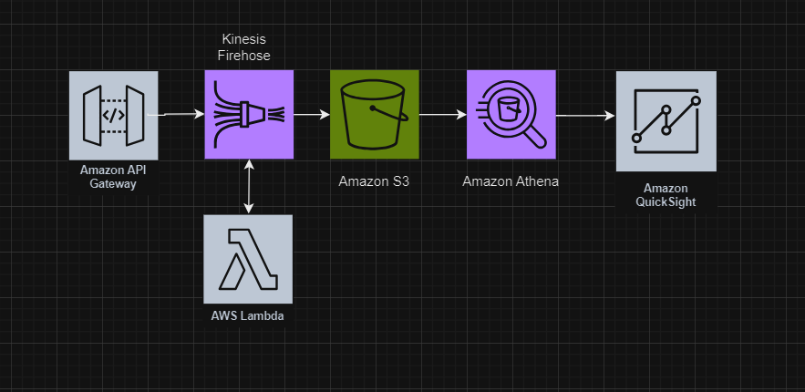

# Data Analytics Proof of Concept

## Project Overview

This project demonstrates a data analytics solution using AWS managed services. It involves the ingestion, transformation, storage, and visualization of clickstream data for a restaurant owner who wants to derive insights from menu item orders.

## Architecture

The architecture involves:
- **API Gateway**: Ingests clickstream data.
- **AWS Lambda**: Transforms the data.
- **Kinesis Data Firehose**: Delivers transformed data to Amazon S3.
- **Amazon S3**: Stores the ingested data.
- **Amazon Athena**: Queries the stored data.
- **Amazon QuickSight**: Visualizes the data.

## Services Used

- **AWS Identity and Access Management (IAM)**: Custom policies and roles.
- **Amazon S3**: Object storage for clickstream data.
- **AWS Lambda**: Data transformation.
- **Amazon Kinesis Data Firehose**: Real-time data delivery to S3.
- **Amazon API Gateway**: REST API for data ingestion.
- **Amazon Athena**: SQL queries on stored data.
- **Amazon QuickSight**: Data visualization and dashboards.

## Steps Completed

1. **IAM Setup**:
    - Created custom IAM policies and roles for secure access to AWS services.

2. **S3 Bucket Creation**:
    - Set up an S3 bucket for storing streaming data.

3. **Lambda Function**:
    - Developed a Lambda function to transform incoming data for storage.

4. **Kinesis Data Firehose**:
    - Created a Firehose delivery stream for real-time data delivery to S3.

5. **API Gateway Setup**:
    - Configured a REST API for data ingestion using API Gateway.

6. **Athena Table Creation**:
    - Established an Athena table to query and view ingested data.

7. **QuickSight Dashboards**:
    - Created QuickSight dashboards to visualize and analyze the data.

## Data Flow

1. **Ingestion**: API Gateway captures clickstream data.
2. **Transformation**: Lambda function processes and transforms the data.
3. **Delivery**: Kinesis Data Firehose delivers the transformed data to S3.
4. **Storage**: Amazon S3 stores the data files.
5. **Querying**: Amazon Athena enables querying of stored data.
6. **Visualization**: Amazon QuickSight visualizes the data for insights.

## Key Takeaways

- **Managed Services**: Leveraged AWS managed services to build a scalable, maintainable data analytics solution.
- **Data Transformation**: Utilized AWS Lambda for real-time data transformation.
- **Real-time Data Ingestion**: Achieved with Kinesis Data Firehose and API Gateway.
- **Data Storage and Querying**: Efficient data storage in S3 and querying with Athena.
- **Data Visualization**: Interactive dashboards created with QuickSight for insights.

## Cleanup

To avoid incurring costs, all AWS resources were deleted after the project completion:
- QuickSight dashboards and account.
- S3 bucket and its contents.
- Athena tables and queries.
